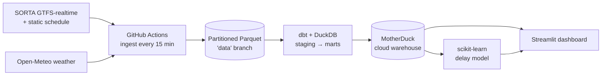

# 🚌 Cincinnati Transit Delay Predictor

An end-to-end data pipeline that ingests **live** Cincinnati Metro (SORTA) bus data every 15
minutes, models it with dbt into a cloud warehouse, trains a machine-learning model to predict
arrival delays, and serves it through a public dashboard — built entirely on free-tier services.


> **Status: early build, actively accruing data.** The pipeline runs continuously; the model is
> retrained daily and its metrics become meaningful after ~a week of ingestion across busy hours.

---

## Why this exists

Most student data projects train a model on a static Kaggle CSV. This one generates its **own**
dataset from a continuously-updating public feed — which is what real data engineering actually is.
The data can't be copy-pasted from a tutorial; it accumulates snapshot by snapshot from Cincinnati's
buses.

## Architecture



| Layer | Tool | Free tier |
|-------|------|-----------|
| Orchestration | **GitHub Actions** (cron) | Unlimited minutes on public repos |
| Raw storage | **Partitioned Parquet** (`data` branch) | Free |
| Transform | **dbt Core + DuckDB** | Open source |
| Cloud warehouse | **MotherDuck** | 10 GB / 10 compute-hrs per month |
| ML | **scikit-learn** | Open source |
| Dashboard | **Streamlit Community Cloud** | Free |
| CI / container | **GitHub Actions + Docker** | Free |

## Data sources (no API keys)

- [SORTA / Cincinnati Metro developer feeds](https://www.go-metro.com/about/developer-data/) — static
  GTFS schedule + GTFS-realtime vehicle positions, trip updates, alerts.
- [Open-Meteo](https://open-meteo.com/) — current weather, used as a model feature (rain/snow drives lateness).

The schedule alone is ~432k `stop_times` rows; each realtime snapshot adds a few thousand predicted
arrivals. **MBTA** (Boston) is wired as a drop-in fallback (identical GTFS-realtime format) since
SORTA's feed is provided "as is" with no uptime guarantee — set `AGENCY=mbta` to switch.

## Engineering notes (things the live feed taught me)

- **WAF blocks default clients.** SORTA's realtime endpoints 403 the `python-requests` User-Agent;
  requests present a browser UA (`ingestion/feeds.py`).
- **`departure.time`, not `arrival.time`.** SORTA populates predicted *departure* on ~98% of stop
  updates and *arrival* on ~1%, so delay uses `coalesce(arrival, departure)`.
- **Non-standard after-midnight service dates.** SORTA reports the physical calendar date in the
  realtime `start_date` while the schedule still encodes those stops with `>24:00:00` clock times,
  which naively double-counts the day rollover (a flat +24h error). The fix anchors the schedule's
  clock-time-of-day to whichever calendar day lands closest to the observed prediction — a bus is
  never more than a few hours off schedule, so the nearest occurrence is unambiguous
  (`transform/models/marts/fct_arrivals.sql`).
- **Time-based validation.** The model trains on earlier arrivals and tests on later ones (never a
  random split) to avoid leakage, with a random-split fallback until the data spans enough time.

## Repo layout

```
ingestion/     fetch realtime feeds + weather → Parquet, and the static schedule
transform/     dbt-duckdb project (staging → marts); fct_arrivals is the labeled delay table
ml/            build_features / train / evaluate → model.pkl + metrics.json
app/           Streamlit dashboard (live map, reliability, predictor, trends)
.github/       ingest (15 min), static-gtfs (weekly), transform-train (daily), ci (PRs)
```

## Run it locally

```bash
python -m venv .venv && . .venv/Scripts/activate      # Windows; use .venv/bin/activate on macOS/Linux
pip install -r requirements-dev.txt

python ingestion/fetch_static_gtfs.py                 # one-time: schedule reference tables
python ingestion/fetch_realtime.py                    # a live snapshot
cd transform && dbt build --profiles-dir . && cd ..   # build + test the marts (local DuckDB)
python ml/train.py                                    # train + write metrics
streamlit run app/streamlit_app.py                    # dashboard at localhost:8501
```

Tests + lint: `ruff check . && pytest -q`.

## Deployment

1. **Ingestion** runs automatically once the repo is public (GitHub Actions, unlimited minutes).
2. **MotherDuck**: create a free account, add the token as a repo secret `MOTHERDUCK_TOKEN`. The daily
   `transform-train` workflow then builds marts into the warehouse and retrains the model.
3. **Streamlit Community Cloud**: deploy `app/streamlit_app.py`, add `MOTHERDUCK_TOKEN` to the app
   secrets. The live map streams straight from the feed; everything else reads the warehouse.

## Current metrics

Live values are written to [`ml/artifacts/metrics.json`](ml/artifacts/metrics.json) on every retrain
(delay MAE / RMSE / R², late-arrival ROC-AUC / precision / recall, all on a temporal holdout, plus an
`is_smoke_model` flag that stays `true` until the data has real temporal spread).

## What this demonstrates

Data ingestion from a live protobuf feed · pipeline orchestration · Parquet/partitioning · dbt data
modeling · a cloud data warehouse · feature engineering · gradient-boosting models with proper
temporal validation · an interactive dashboard · Docker + CI. Handling a genuinely messy real-world
feed (WAF, non-standard service dates, sparse fields) is the point, not an afterthought.

---

*Transit data © SORTA/Cincinnati Metro, used under their developer terms. Weather by Open-Meteo.*

*Built by Caleb Yost, in conjunction with Claude Opus 4.8.*
