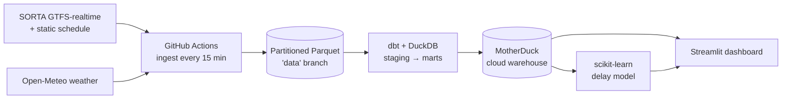

# Cincinnati Transit Delay Predictor

A live data pipeline that predicts how late Cincinnati Metro (SORTA) buses run. It pulls the city's GTFS-realtime feed every 15 minutes, models each snapshot against the published schedule to measure real delay, enriches it with weather, and trains a gradient-boosting model on a time-based holdout. A Streamlit dashboard serves the live vehicle map and the predictor. Everything runs on free-tier services.


> Status: early build, still collecting data. The pipeline runs on its own and the model retrains daily. The metrics only start meaning something after about a week of collection, once there's data from both rush hour and the quiet parts of the day.

## What it does

The dataset isn't a file that was downloaded once. It's collected live from the city's buses, one snapshot every fifteen minutes, and it keeps growing whether or not anyone is watching. Each snapshot is landed as partitioned Parquet, modeled into a warehouse, and joined back to the schedule to compute how late every arrival actually was. That labeled history is what the model trains on.

The delay calculation is calibrated against the live feed's real behavior rather than an idealized schedule:

- **Live GTFS-realtime ingestion:** trip updates, vehicle positions, and predicted arrivals, pulled straight from the protobuf feed with a browser User-Agent (the default Python request gets a 403).
- **Schedule-adherence modeling:** dbt + DuckDB stage the raw feed and build `fct_arrivals`, the labeled delay table, resolving the after-midnight clock mismatch between realtime dates and schedule times above 24:00.
- **Weather enrichment:** current conditions from Open-Meteo fed in as features, since rain and snow push buses off schedule.
- **Delay model:** a HistGradientBoosting regressor for minutes-late plus a classifier for the late-arrival flag, both trained on a time-based split so the model can't peek at the future.
- **Cloud warehouse:** marts materialized into MotherDuck; the dashboard and training job both read from there.
- **Self-sustaining cadence:** GitHub Actions cron fires four snapshots per run to beat throttling, and prunes anything older than 60 days. No intervention needed once it's live.
- **Fallback agency:** MBTA is wired up on the same GTFS-realtime format, so a demo survives a SORTA outage. Set `AGENCY=mbta` to switch.
- **Live dashboard:** an Apple-styled Streamlit app with a vehicle map, a stop-level predictor, route reliability, and delay-by-time-of-day trends.

## Architecture



```
ingestion/
  fetch_realtime.py       pull trip updates, vehicle positions, weather to Parquet
  fetch_static_gtfs.py    download + extract the static schedule tables
  feeds.py                feed URLs, headers, agency switch
transform/
  models/staging/         cast + clean the raw feed (parse >24:00 times, coalesce arrival/departure)
  models/marts/           fct_arrivals (labeled delay), mart_stop_delays (ML source), reliability, dims
  profiles.yml            dbt-duckdb; MotherDuck in prod, local DuckDB in dev
ml/
  build_features.py       feature row assembly + null handling
  train.py                time-based split, train regressor + classifier, write metrics.json
app/
  streamlit_app.py        live map, predictor, reliability + trend panels
.github/workflows/        ingest (15 min), static-gtfs (weekly), transform-train (daily), ci (PRs)
```

| Layer | Tool | Free tier |
|-------|------|-----------|
| Orchestration | GitHub Actions (cron) | Unlimited minutes on public repos |
| Raw storage | Partitioned Parquet (`data` branch) | Free |
| Transform | dbt Core + DuckDB | Open source |
| Cloud warehouse | MotherDuck | 10 GB, 10 compute-hours per month |
| ML | scikit-learn | Open source |
| Dashboard | Streamlit Community Cloud | Free |
| CI, container | GitHub Actions, Docker | Free |

## Data sources (no API keys)

- [SORTA / Cincinnati Metro developer feeds](https://www.go-metro.com/about/developer-data/): the static GTFS schedule plus realtime vehicle positions, trip updates, and alerts.
- [Open-Meteo](https://open-meteo.com/): current weather, fed to the model since rain and snow tend to push buses off schedule.

The schedule alone is about 432,000 `stop_times` rows, and every realtime snapshot adds a few thousand predicted arrivals.

## Notes from working with a live feed

A few things only turned up once real data started moving. These are the parts that made it a real system instead of a notebook:

- **The feed rejects naive requests.** SORTA's realtime endpoints hand back a 403 to the default Python User-Agent, so every request sends a browser one.
- **Departures, not arrivals.** The feed fills in predicted *departure* times far more often than *arrival* times, roughly 98 percent against 1 percent, so the delay math takes whichever one is present.
- **The after-midnight trap.** The realtime `start_date` and the schedule disagree about trips running past midnight. SORTA reports the calendar date while the schedule uses clock times above 24:00, and stacking the two adds a flat 24 hours. The fix anchors the scheduled time to whichever calendar day sits closest to the observed prediction. A bus is never off by more than a couple hours, so the closest day is always the right one.
- **No peeking.** Training uses a time-based split, older data to train and newer to test, so the model can't learn from the future it's meant to predict.

## Run it locally

```bash
python -m venv .venv && . .venv/Scripts/activate      # Windows; use .venv/bin/activate on macOS/Linux
pip install -r requirements-dev.txt

python ingestion/fetch_static_gtfs.py                 # one-time: schedule reference tables
python ingestion/fetch_realtime.py                    # a live snapshot
cd transform && dbt build --profiles-dir . && cd ..   # build + test the marts (local DuckDB)
python ml/train.py                                    # train + write metrics
streamlit run app/streamlit_app.py                    # dashboard at localhost:8501
```

Tests and lint: `ruff check . && pytest -q`.

## Deployment

1. Ingestion starts on its own once the repo is public (GitHub Actions).
2. MotherDuck: make a free account and add the token as a repo secret named `MOTHERDUCK_TOKEN`. The daily transform-train job then builds the marts into the warehouse and retrains the model.
3. Streamlit Community Cloud: deploy `app/streamlit_app.py` and add `MOTHERDUCK_TOKEN` to the app secrets. The live map streams straight from the feed; the rest reads the warehouse.

## Metrics

Every retrain writes the current values to [`ml/artifacts/metrics.json`](ml/artifacts/metrics.json): delay MAE, RMSE, and R2 for the regressor, ROC-AUC with precision and recall for the late-arrival classifier, all on a time-based holdout. An `is_smoke_model` flag stays true until the data covers enough hours and days to trust the numbers. A readout looks like this:

```
226,673 rows · 3 service days · MAE 4.66 min vs 2.64 baseline · ROC-AUC 0.636
```

Early on the model can lose to a naive baseline, which is expected: three days of data can't teach day-of-week rhythm, and weather barely varies over a weekend. The one-week mark is where that changes.

---

*Transit data © SORTA / Cincinnati Metro, used under their developer terms. Weather by Open-Meteo.*

*Built by Caleb Yost, in conjunction with Claude Opus 4.8.*
