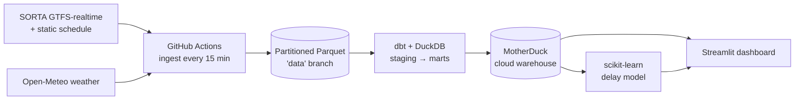

# 🚌 Cincinnati Transit Delay Predictor

A pipeline that pulls live Cincinnati Metro (SORTA) bus data every 15 minutes, models it into a
warehouse, and trains a model to predict how late a bus will run. All of it runs on free-tier
services.


> Status: early build, still collecting data. The pipeline runs on its own and the model retrains
> every day. The numbers start meaning something after about a week of collection, once there's data
> from both rush hour and the quiet parts of the day.

## Why I built it

I wanted a project that behaves like a real data system instead of a notebook you run once. So the
dataset isn't a file I downloaded. It's collected live from the city's buses, one snapshot every
fifteen minutes, and it keeps growing whether or not I'm watching. That shifts the whole problem.
You have to think about scheduling the pulls, storing them, handling a feed that changes shape on
you, and deciding what happens when the feed goes quiet at two in the morning.

## Architecture



| Layer | Tool | Free tier |
|-------|------|-----------|
| Orchestration | GitHub Actions (cron) | Unlimited minutes on public repos |
| Raw storage | Partitioned Parquet (`data` branch) | Free |
| Transform | dbt Core + DuckDB | Open source |
| Cloud warehouse | MotherDuck | 10 GB, 10 compute-hours per month |
| ML | scikit-learn | Open source |
| Dashboard | Streamlit Community Cloud | Free |
| CI, container | GitHub Actions, Docker | Free |

## Data sources (no API keys)

- [SORTA / Cincinnati Metro developer feeds](https://www.go-metro.com/about/developer-data/): the
  static GTFS schedule plus realtime vehicle positions, trip updates, and alerts.
- [Open-Meteo](https://open-meteo.com/): current weather, fed to the model as a feature since rain
  and snow tend to push buses off schedule.

The schedule alone is about 432,000 `stop_times` rows, and every realtime snapshot adds a few
thousand predicted arrivals. Boston's MBTA is wired up as a fallback because it publishes the same
GTFS-realtime format, so a demo won't break if SORTA's feed goes down (it comes with no uptime
promise). Set `AGENCY=mbta` to switch.

## Notes from working with a live feed

A few things only turned up once real data started moving:

- SORTA's realtime endpoints hand back a 403 to the default Python request. They want a browser
  User-Agent, so every request sends one.
- The feed fills in predicted *departure* times far more often than *arrival* times, roughly 98
  percent against 1 percent, so the delay math takes whichever one is there.
- The realtime `start_date` and the schedule disagree about trips that run past midnight. SORTA
  reports the calendar date while the schedule still uses clock times above 24:00, and stacking the
  two adds a flat 24 hours. The fix anchors the scheduled time to whichever calendar day sits closest
  to the observed prediction. A bus is never off by more than a couple hours, so the closest one is
  always the right one.
- Training uses a time-based split, older data to train and newer data to test, so the model can't
  peek at the future.

## Repo layout

```
ingestion/     pull the realtime feeds + weather to Parquet, and the static schedule
transform/     dbt-duckdb project (staging → marts); fct_arrivals is the labeled delay table
ml/            build_features / train / evaluate → model.pkl + metrics.json
app/           Streamlit dashboard (live map, reliability, predictor, trends)
.github/       ingest (15 min), static-gtfs (weekly), transform-train (daily), ci (PRs)
```

## Run it locally

```bash
python -m venv .venv && . .venv/Scripts/activate      # Windows; use .venv/bin/activate on macOS/Linux
pip install -r requirements-dev.txt

python ingestion/fetch_static_gtfs.py                 # one-time: schedule reference tables
python ingestion/fetch_realtime.py                    # a live snapshot
cd transform && dbt build --profiles-dir . && cd ..   # build + test the marts (local DuckDB)
python ml/train.py                                    # train + write metrics
streamlit run app/streamlit_app.py                    # dashboard at localhost:8501
```

Tests and lint: `ruff check . && pytest -q`.

## Deployment

1. Ingestion starts on its own once the repo is public (GitHub Actions).
2. MotherDuck: make a free account and add the token as a repo secret named `MOTHERDUCK_TOKEN`. The
   daily transform-train job then builds the marts into the warehouse and retrains the model.
3. Streamlit Community Cloud: deploy `app/streamlit_app.py` and add `MOTHERDUCK_TOKEN` to the app
   secrets. The live map streams straight from the feed, and the rest reads the warehouse.

## Current metrics

The live values land in [`ml/artifacts/metrics.json`](ml/artifacts/metrics.json) on every retrain:
delay MAE, RMSE, and R2 for the regressor, and ROC-AUC with precision and recall for the
late-arrival classifier, all on a time-based holdout. There's an `is_smoke_model` flag that stays
true until the data covers enough hours and days to trust.

## What it covers

The stack runs through most of a real data workflow: reading a live protobuf feed, scheduling the
reads, landing partitioned Parquet, modeling with dbt into a cloud warehouse, building features,
training and checking a gradient-boosting model with a time-based split, and serving it through a
dashboard. It's containerized and has CI on every PR. The part I'm most glad I pushed through is the
messy edges of the feed, since that's where most of the real work turned out to be.

---

*Transit data © SORTA / Cincinnati Metro, used under their developer terms. Weather by Open-Meteo.*

*Built by Caleb Yost, in conjunction with Claude Opus 4.8.*
